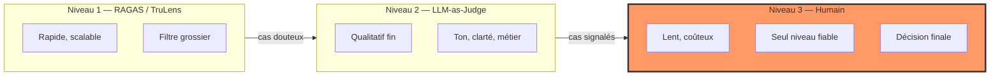
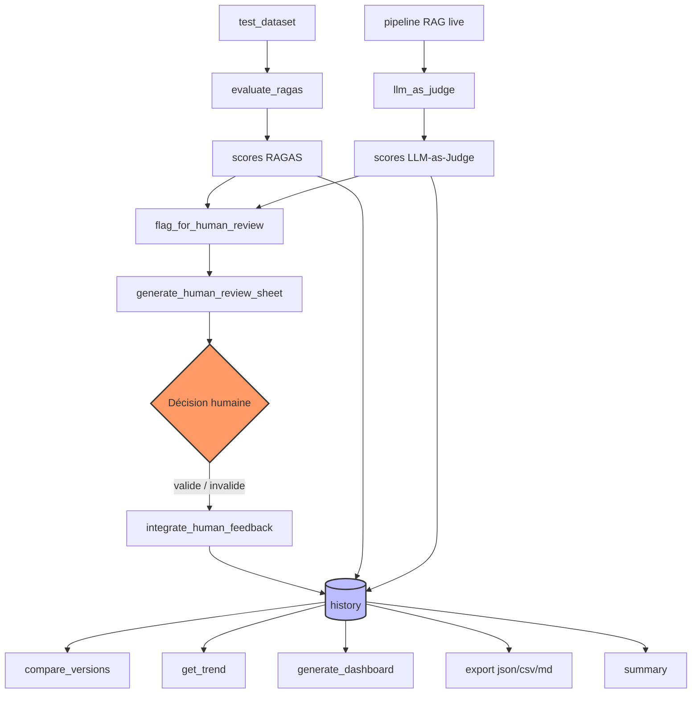

# 🧪 RagEval

[](https://github.com/philippe-montaclair/rag-evaluation-agent/actions/workflows/ci.yml)
[](./LICENSE)


Agent d'évaluation automatique pour pipelines **RAG** (Retrieval-Augmented Generation), conçu pour **prioriser** — jamais remplacer — la vérification humaine.

> ⚖️ **Validation juridique humaine requise avant tout usage commercial.** Ce projet et le RAG « droit locatif » qui sert d'exemple sont des outils d'aide et de test. Leurs réponses n'ont **pas** de valeur juridique et peuvent être incomplètes, périmées ou fausses (y compris sur l'entrée en vigueur des textes, ex. dispositifs applicables au 1er janvier 2027). Toute utilisation commerciale ou en production suppose une validation préalable par un professionnel du droit.

> 🩺 **Un score anormal ?** Voir le [mémento diagnostic](./MEMENTO_DIAGNOSTIC_RAG.md) ([PDF imprimable](./MEMENTO_DIAGNOSTIC_RAG.pdf)) : cause → action immédiate → piège de surapprentissage, pour chaque métrique.

---

## 📐 Philosophie : les 3 niveaux d'évaluation



> ⚠️ **Règle d'or** : l'agent ne fait jamais l'impasse sur le niveau 3.
> Il réduit uniquement le **volume** de travail humain nécessaire, en
> priorisant les cas les plus douteux ou les plus critiques.

---

## 🚀 Installation

```bash
# Installation minimale (cœur seulement)
pip install -r requirements-core.txt

# Installation complète (avec TruLens, Phoenix, Prometheus)
pip install -r requirements.txt

# Ou via pyproject.toml
pip install ".[all,dev]"
```

Voir [`requirements.txt`](./requirements.txt) et [`pyproject.toml`](./pyproject.toml) pour le détail des versions.

---

## 🏗️ Architecture

```
rag_evaluation_agent.py       # Classe principale RagEval (alias : RAGEvaluationAgent)
test_rag_evaluation_agent.py  # Suite de tests pytest (mockée, sans réseau)
requirements.txt              # Dépendances complètes
requirements-core.txt         # Dépendances minimales
pyproject.toml                # Packaging + config outils (black, ruff, pytest)
README.md                     # Ce fichier
```

### Flux de données complet



---

## 📋 Méthodes principales

| Méthode | Rôle |
|---|---|
| `evaluate_ragas(dataset, version_id)` | Calcule les scores RAGAS (faithfulness, answer_relevancy, context_precision, context_recall) |
| `evaluate_trulens(...)` | Suivi continu optionnel via TruLens |
| `llm_as_judge(question, context, answer, criteria)` | Note UN cas (0-1 normalisé depuis 1-5) + justification |
| `evaluate_llm_judge(dataset, criteria, version_id)` | Juge tout le jeu et **historise** un run niveau 2 (dashboard/tendance) |
| `flag_for_human_review(scores, score_key, threshold)` | Sélectionne les cas à faire vérifier par un humain |
| `generate_human_review_sheet(flagged)` | Génère des fiches structurées pour les relecteurs |
| `integrate_human_feedback(sheet_id, decision, comment)` | Réinjecte la décision humaine dans l'historique |
| `compare_versions(id_a, id_b)` | Diff entre deux versions du pipeline (détection de régression) |
| `get_trend(metric)` | Évolution d'une métrique dans le temps |
| `generate_dashboard(filepath)` | Dashboard HTML (Chart.js) auto-généré |
| `export(format, filepath)` | Export JSON / CSV / Markdown |
| `summary()` | Résumé exécutif + recommandations |

---

## 💡 Exemple d'utilisation complet

```python
from rag_evaluation_agent import RagEval  # (alias rétro-compat : RAGEvaluationAgent)

# 1. Initialisation
agent = RagEval(
    pipeline=mon_pipeline_rag,      # fonction query -> {answer, contexts, ground_truth}
    judge_model="gpt-4o-mini",
    pipeline_model="mon-modele-prod",
    enable_trulens=False,
    enable_phoenix=False,
)

# 2. Évaluation RAGAS (niveau 1)
test_dataset = [
    {
        "question": "Quelle est la capitale de la France ?",
        "answer": "Paris est la capitale de la France.",
        "contexts": ["Paris est la capitale de la France depuis..."],
        "ground_truth": "Paris",
    },
    # ...
]
run_v1 = agent.evaluate_ragas(test_dataset, version_id="v1")

# 3. LLM-as-Judge (niveau 2)
# llm_as_judge note UN cas (0-1, normalisé depuis 1-5) ; evaluate_llm_judge
# fait tourner le juge sur tout le jeu ET historise le run (niveau 2).
judged = agent.evaluate_llm_judge(test_dataset, criteria=["exactitude", "clarté", "ton"], version_id="v1-judge")

# 4. Sélection des cas à vérifier (niveau 3)
flagged = agent.flag_for_human_review(judged, score_key="faithfulness", threshold=0.7)

# 5. Fiches de vérification humaine
sheets = agent.generate_human_review_sheet(flagged)

# 6. Décision humaine (à faire manuellement, ici simulée)
if sheets:
    agent.integrate_human_feedback(sheets[0]["id"], "valide", "RAS, conforme.")

# 7. Comparaison entre versions
run_v2 = agent.evaluate_ragas(test_dataset, version_id="v2")
diff = agent.compare_versions("v1", "v2")
print(diff)

# 8. Dashboard + exports
agent.generate_dashboard("dashboard.html")
agent.export(format="json", filepath="rapport.json")
agent.export(format="markdown", filepath="rapport.md")

# 9. Résumé exécutif
print(agent.summary())
```

---

## ✅ Tests

```bash
pip install -r requirements.txt  # inclut pytest, pytest-mock, pytest-cov

pytest test_rag_evaluation_agent.py -v --tb=short

# Avec couverture
pytest test_rag_evaluation_agent.py --cov=rag_evaluation_agent --cov-report=term-missing
```

Tous les tests sont **mockés** (RAGAS, OpenAI, TruLens, Prometheus) → aucune clé API ni connexion réseau requise.

**Couverture des tests** :

| Catégorie | Nb tests |
|---|---|
| Initialisation | 4 |
| RAGAS | 5 |
| TruLens | 2 |
| LLM-as-Judge | 5 |
| Sélection humaine | 5 |
| Fiches & feedback | 4 |
| Historique/comparaison | 4 |
| Exports | 6 |
| Dashboard | 2 |
| Summary | 4 |
| Prometheus | 4 |
| Intégration bout en bout | 1 |

---

## ⚠️ Points d'attention

- **`ragas`** évolue vite (breaking changes fréquents) → versions bornées dans `requirements.txt`.
- **`trulens_eval`** a changé de nom de package plusieurs fois → vérifier sur PyPI avant installation réelle.
- **`arize-phoenix`** peut nécessiter des extras (`arize-phoenix[evals]`) selon l'usage.
- Le module peut être scindé (`ragas_eval.py`, `judge.py`, `human_review.py`, `export.py`) si le projet grossit.
- **Aucun niveau ne remplace le niveau 3** : ce système est un outil de **priorisation**, pas d'automatisation totale du jugement.

---

## 📄 Licence

MIT — voir [`pyproject.toml`](./pyproject.toml)

---

## 🔗 Ressources liées

- [RAGAS documentation](https://docs.ragas.io/)
- [TruLens documentation](https://www.trulens.org/)
- [Arize Phoenix documentation](https://docs.arize.com/phoenix/)